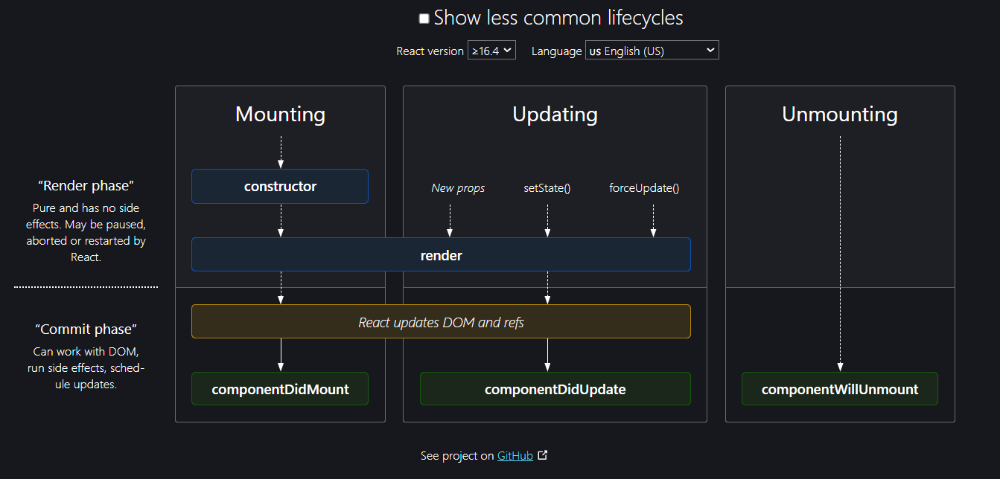

# Namaste React

# Parcel

- Dev Build
- Local Server
- HMR (Hot Module Refreshment)/ Automatically refresh the page
- File Watching Algorithm - written in C++
- Caching - Faster Builds
- Image Optimization
- Minification
- Bundling
- Compress
- Consistent Hashing : read yourself
- Code Splitting
- Differential Bundling - To support older browsers
- Diagnostic
- Error Handling
- HTTPs
- Tree Shaking - remove unused code
- Different dev and prod bundles

# Namaste Food

- Components
- Header
- - Logo
- - Nav Items
- Body
- - Search
- - RestaurantContainer
- - RestaurantCard
-      - Img
-      - Name of Res, Star Rating, cuisine,
- Footer
- - Copyright
- - Links
- - Address
- - Contact

## Two types of Export/Import

- Default Export/Import

export default Component;
import Component from "path";

- Named Export/Import

export const Component;
import {Component} from "path";

# React Hooks

React Hooks is basically (Normal JS utility functions), Which return some piece of JSX.

useState() - Superpowerfull state Variable in react

`Syntax : const [btnName,setBtnName] = useState("Login")`

`Syntax : useEffect( () => {}, [] ) `

# Two Approaches to make an api call

### First Approach

- As soon as page loads we can make api call and wait for response after get response then we render the UI

`Loads => API call(wait for resp) => Render`

### Second Approach

- As soon as page loads just render it whatever have just render it then make an api call then re-render it

- In React we use this approach. This is the better approach and It gives better UX (User Experience)

- If u think it render twice it can't matters because react renders your UI very fast

`Loads => Render => API call => Re-render `

- We can implement second approach using useEffect() hook in functional component
- In class based we use ComponentDidMount()

## useEffect

`If no dependency array => useEffect is called on every render`

    import {useEffect} from 'react;
    useEffect( () => {} )

`If dependency array is empty = [] => useEffect is called on initial render(just once)`

    import {useEffect} from 'react;
    useEffect( () => {}, [] )

`If dependency array is [btnName] => called everytime btnName is updated`

    import {useEffect} from 'react;
    useEffect( () => {}, [btnName])

## useState

Syntax:

    import {useState} from 'react;
    const [btnName,setBtnName] = useState("Login")

- Whenever state variables update, react triggers a reconciliation cycle(re-renders the component)

# There are 2 Types of Routing in web apps

### Client Side Routing :

In Client-side routing (CSR), during the first load, the webapp is loaded from server to client, after which whenever there is a change in URL, the router library navigates the user to the new page without sending any request to backend. All Single Page Applications uses client-side routing.

### Server Side Routing :

In Server-side routing (SSR), every change in URL, http request is made to server to fetch the webpage, and replace the current webpage with the older one.

# Ask in many interviews

# React Life-Cycle Method for multiple children's



- Parent Constructor
- Parent render

  `This is the "Render" phase for both the childrens`

  - First Constructor
  - First Render

  - Second Constructor
  - Second Render

  `DOM UPDATED - IN SINGLE BATCH => In a single Batch both are the childrens are updated`
  `This is the "Commit" phase for both the childrens`

  - First ComponentDidMount
  - Second ComponentDidMount

- Parent ComponentDidMount-

> Image Source : https://projects.wojtekmaj.pl/react-lifecycle-methods-diagram/

## Class Based

```JSX
import React from "react";
// Whenever u loading/mounting a class based components on the web-page the instance of that class was created

// Whenever u created a instance of a class the constructor was called & this is the best place to receive a props and create a state variable inside a constructor

class UserClass extends React.Component {
  constructor(props) {
    super(props);
    console.log(this.props.name + "Child Constructor");

    // Imp Note : This state keyword itself it is a big object which can hold all the state variables. In the functional components react do the same thing behind the scene to hold all the state varibales inside a big object like class do.

    // Multiple state variable created
    // this.state = {};
    this.state = {
      userInfo: { name: "Dummy", location: "default" },
    };
  }
//   componentDidMount() {
//     console.log(this.props.name + "child Component Did Mount");
//   }
 async componentDidMount() {
    // console.log(this.props.name + "child Component Did Mount");
    // api call
    const data = await fetch("https://api.github.com/users/BhaveshWagh");
    const json = await data.json();

    this.setState({
      userInfo: json,
    });

    console.log(json);
  }
  componentDidUpdate(){
    console.log("Component Did Update")
  }
  render() {
    console.log(this.props.name + "Child Render");

    // Destructure on a fly
    // const { name, location } = this.props;
    const { name, location, avatar_url } = this.state.userInfo;


    return (
      <div className="user-card">
        <h1>
          Count : {count} : count_2 : {count2}
        </h1>
        <button
          onClick={() => {
            // NEVER UPDATE STATE VARIBLES DIRECTLY
            // React gives u access to an important function this is known as this.setState() and pass an object that object contains updated values
            this.setState({
              count: this.state.count + 1,
            });
            // whenever this state variable is updated  react will re-render the component
          }}
        >
          Count Increase
        </button>
       
        <h2>Name : {name}</h2>
        <h3>Location : {location}</h3>
        <h4>Contact : 7058857983</h4>
      </div>
    );
  }
}

export default UserClass;

```

# How React Life-cylce method works behind the scene, When we make an api call using componentDidMount

## : Note Never ever compare your reacts life cycle method to functional component

> useEffect != componentDidMount

> Mount and update both are different things

- MOUNTING

  > Constructor (dummy)

  > Render (dummy)

  > HTML Dummy

  > Component Did Mount

  > API call

  `<this.setState> -> State variable is updated`

* Now update cycle called =>

- UPDATING

  > Render(API data)

  > HTML (new API data)

  > Component Did Update

- Parent Constructor
- Parent Render
- FirstChild Constructor
- FirstChild Render
- Firstchild Component Did Mount
- Parent Component Did Mount
- FirstChild Render
- Component Did Update

# ComponentDidUpdate :

- The component did update method is called after every update
  ex: with the

`Syntax : componentDidUpdate(){}`

# ComponentWillUnMount :

- Component will unmount called when we leaving a page

- When you creating mess then you have to clean up also

ComponentWillUnMount(){
clearInterval(this.variableName)
}

## Very imp : Optimize Our App

Smaller Logical Chunks for Large Scale Application

When our bunddle size increasing so to reduce the size we do this code splitting / chuncking / lazy loading when we do this all the code does not come at once and it will only come when it is requested.

So that your request for that js file does not become so heavy that take's a lot off time to get into the browser thats why we use below thing chuncking

- Chunking
- Code splitting
- Dynamic Bundling
- Lazy Loading (on required) : means when we go to the grocery then load this initial don't load that component
- On demand loading
- dynamic import

This is how we distribute our application into smaller chunks
This is how you improve performance

```jsx
import React, { lazy, Suspense } from "react";

const Grocery = lazy(() => import("./components/Grocery"));

      {
        path: "/grocery",
        element: (
          <Suspense fallback={<h1>Loading....</h1>}>
            <Grocery />
          </Suspense>
        ),
      },
```

## Higher Order Component

#### Higher-order components (HOCs) are a powerful feature of the React library. They allow you to reuse component logic across multiple components.

In React, a higher-order component is a function that takes a component as an argument and returns a new component that wraps the original component.
Take input - RestaurantCard ==> RestaurantCardPromoted => and return a inhanced component ont the top of it

##### Benefits of Using Higher-Order Components in React

- Reusability: HOCs allow you to reuse component logic across multiple components, which can save time and reduce code duplication.

- Flexibility: HOCs can take additional arguments, which allows you to customize the behavior of the HOC. This makes them a flexible way to add functionality to your components.

- Separation of concerns: HOCs can help separate concerns in your code by encapsulating certain functionality in a separate component. This can make the code easier to read and maintain.

- Composition: HOCs can be composed together to create more complex functionality. This allows you to build up functionality from smaller, reusable pieces.

- Higher-order components can be used to implement cross-cutting concerns in your application such as authentication, error handling, logging, performance tracking, and many other features.

##### When to Use HOCs in your React Code

- Authentication
Suppose you have an application with various routes, some of which require the user to be authenticated before accessing them.

- Instead of duplicating the authentication logic in each component or route, you can create an HOC called withAuth that checks if the user is authenticated and redirects them to the login page if not. Then, you can wrap the specific components or routes that need authentication with this HOC, reducing duplication and enforcing consistent authentication behavior.

- Logging
Imagine you want to log some data every time a specific set of components mount or update. Rather than adding the logging logic to each component, you can create an HOC called withLogger that handles the logging functionality.

- By wrapping the relevant components with withLogger, you can achieve consistent logging across those components.

- Styling and Theming
You might have a design system with reusable styles and themes. You can create an HOC named withTheme that provides the necessary theme-related props to a component.

This way, the wrapped component can easily access and apply the appropriate styles based on the provided theme.

```jsx
// RestaurantCard.js

export const withPromotedLabel = (RestaurantCard) => {
  // New Component
  return (props) => {
    return (
      <div>
        <label className="absolute bg-black text-white m-2 p-2 rounded-lg">
          Promoted
        </label>
        <RestaurantCard {...props} />
      </div>
    );
  };
};

//Body.js
const RestaurantCardPromoted = withPromotedLabel(RestaurantCard);

{
  /** if the restaurant is promoted then add a promoted label to it*/
  res.info.promoted ? (
    <RestaurantCardPromoted resData={res.info} />
  ) : (
    <RestaurantCard resData={res.info} />
  );
}
```
reference : https://www.freecodecamp.org/news/higher-order-components-in-react/#:~:text=Higher%2Dorder%20components%20(HOCs),that%20wraps%20the%20original%20component.
